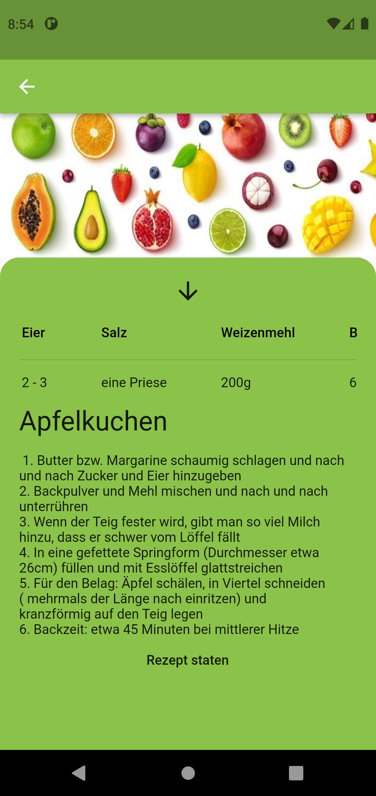
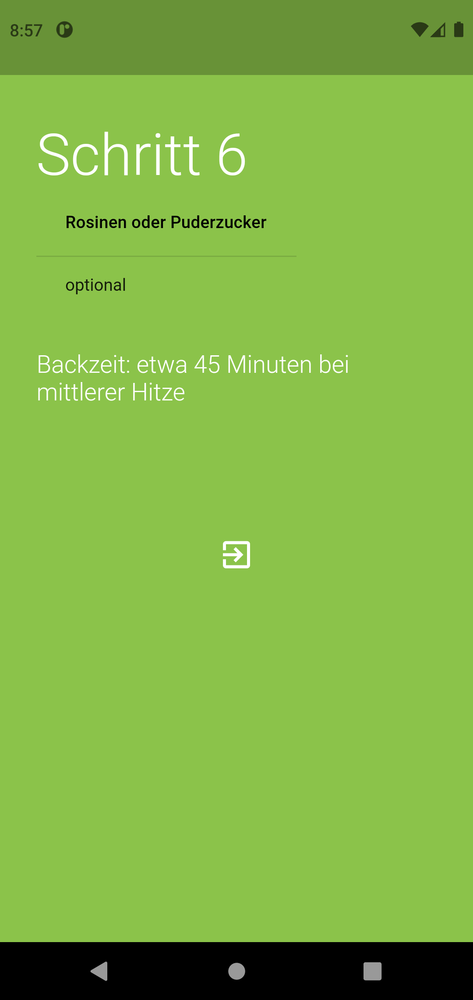
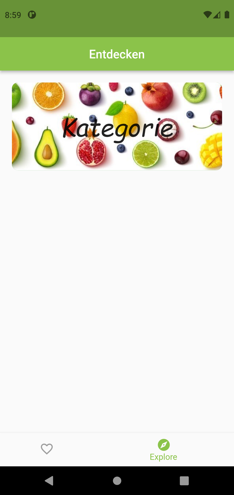

# best_of_rest

## Die Best of rest App der Klasse 8c 

### Instalation
1. Flutter SDK instalieren
2. Dart SDK instalieren
3. Android Studio instalieren
4. Git repo klonen und in Android Studio öfnen

### Demo
Rezept Vorschau

Rezept Ansicht

Rezept Ende

Entdecken Seite

Favoriten Seite

