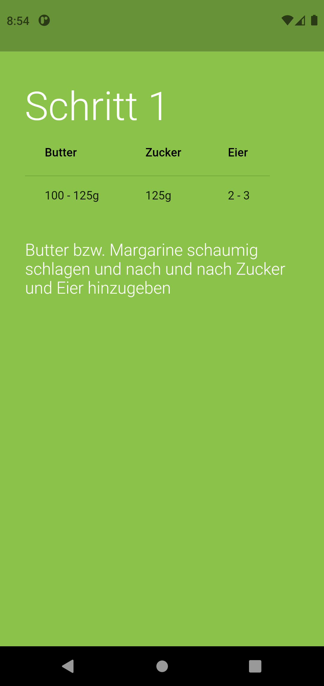

# best_of_rest

## Die Best of rest App der Klasse 8c 

### Installation
1. Flutter SDK installieren
2. Dart SDK installieren
3. Android Studio installieren
4. Git repo klonen und in Android Studio öffnen

### Demo
Rezept Vorschau

Rezept Ansicht

Rezept Ende

Entdecken Seite

Favoriten Seite

Demo Video
<video controls>
<source src="https://demo.jan-kupke.de/rezepte-app" type="video/mp4">
<a href="https://demo.jan-kupke.de/rezepte-app" target="_blank">Alternativ Link</a>
</video>
